# Создание и нормализация базы данных (vo_HW)
### Тема домашней работы: Создание и нормализация базы данных.
### Цель домашней работы: Научиться создавать базы данных и нормализовать их. 
### Формулировка задания: 
Дан файл с данными по клиентам и транзакциям: (customer_and_transaction.xlsx)[https://github.com/Max-Zima/mipt-data-storage-and-processing-systems/blob/master/Домашнее%20задание%201.%20Создание%20и%20нормализация%20базы%20данных/customer_and_transaction.xlsx]

Необходимо выполнить следующие пункты:  
* Продумать структуру базы данных и отрисовать в [редакторе](https://dbdiagram.io/home?utm_source=holistics&utm_medium=top_5_tools_blog).  
* Нормализовать базу данных (1НФ — 3НФ), описав, к какой нормальной форме приводится таблица и почему таблица в этой нормальной форме изначально не находилась.  
* Создать все таблицы в DBeaver, указав первичные ключи к таблицам, правильные типы данных, могут ли поля быть пустыми или нет (использовать команду CREATE TABLE). 
* Загрузить данные в таблицы в соответствии с созданной структурой (использовать команду INSERT INTO или загрузить файлы, используя возможности инструмента DBeaver; в случае загрузки файлами приложить скрины, что данные действительно были   залиты).

## Выполнение:

### Задание 1
ERD:
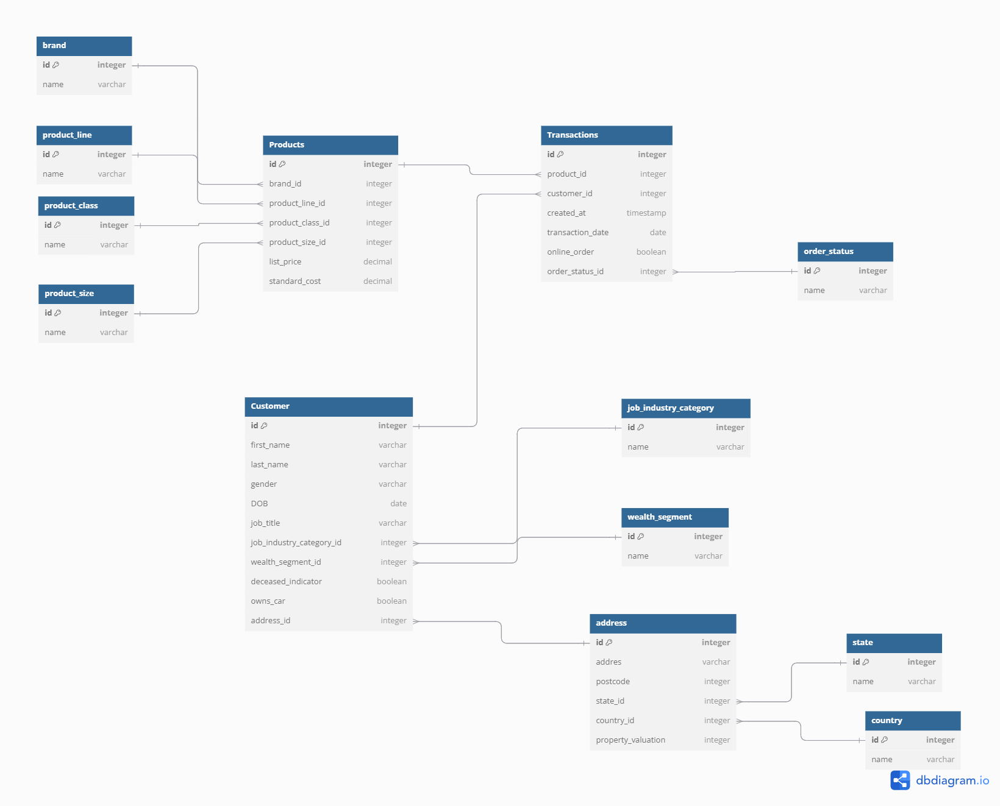

### Задание 2

Нормализация:
1. Первая нормальная форма (1НФ):
   * Убедимся, что все атрибуты атомарны (не содержат повторяющихся групп).
   * Пример: В таблице Customers поля first_name, last_name, gender и т.д. уже атомарны.
2. Вторая нормальная форма (2НФ):
   * Убедимся, что все неключевые атрибуты зависят от полного первичного ключа.
   * Пример: В таблице Transactions первичный ключ — transaction_id, и все атрибуты зависят от него.
3. Третья нормальная форма (3НФ):
   * Убедимся, что нет транзитивных зависимостей.
   * Пример: В таблице Customers поле address зависит от address_id, а не напрямую от customer_id.

### Задание 3
> Создать все таблицы в DBeaver, указав первичные ключи к таблицам, правильные типы данных, 
> могут ли поля быть пустыми или нет (использовать команду CREATE TABLE).

```postgresql
BEGIN;
create database customer_and_transaction;

create table if not exists Customer (
  id integer primary key
  , first_name varchar
  , last_name varchar
  , gender varchar
  , DOB date
  , job_title varchar
  , job_industry_category_id integer
  , wealth_segment_id integer
  , deceased_indicator boolean
  , owns_car boolean
  , address_id integer
);

create table if not exists job_industry_category (
  id integer primary key
  , name varchar
);

create table if not exists wealth_segment (
  id integer primary key
  , name varchar
);

create table if not exists address (
  id integer primary key
  , addres varchar
  , postcode integer
  , state_id integer
  , country_id integer
  , property_valuation integer
);

create table if not exists state (
  id integer primary key
  , name varchar
);


create table if not exists country (
  id integer primary key
  , name varchar
);


create table if not exists Transactions (
  id integer primary key
  , product_id integer
  , customer_id integer
  , transaction_date date
  , online_order boolean
  , order_status_id integer
);

create table if not exists order_status (
  id integer primary key
  , name varchar
);

create table if not exists Products (
  id integer primary key
  , brand_id integer
  , product_line_id integer
  , product_class_id integer
  , product_size_id integer
  , list_price decimal
  , standard_cost decimal
);

create table if not exists brand (
  id integer primary key
  , name varchar
);

create table if not exists product_line (
  id integer primary key
  , name varchar
);

create table if not exists product_class (
  id integer primary key
  , name varchar
);

create table if not exists product_size (
  id integer primary key
  , name varchar
);

alter table Customer add foreign key (job_industry_category_id) references job_industry_category (id)

alter table Customer add foreign key (wealth_segment_id) references wealth_segment (id)

alter table Customer add foreign key (address_id) references address (id)

alter table address add foreign key (state_id) references state (id)

alter table address add foreign key (country_id) references country (id)

alter table transactions add foreign key (customer_id) references Customer (id)

alter table transactions add foreign key (product_id) references Products (id)

alter table transactions add foreign key (order_status_id) references order_status (id)

alter table products add foreign key  (brand_id) references brand (id)

alter table products add foreign key  (product_line_id) references product_line (id)

alter table products add foreign key  (product_class_id) references product_class (id)

alter table products add foreign key  (product_size_id) references product_size (id)
COMMIT;
```

### Задание 4
> Загрузить данные в таблицы в соответствии с созданной структурой 
> (использовать команду INSERT INTO или загрузить файлы, используя возможности инструмента DBeaver; 
> в случае загрузки файлами приложить скрины, что данные действительно были залиты).
```postgresql
BEGIN;
insert into job_industry_category (id, name) values 
(1, 'Health'),
(2, 'Financial Services'),
(3, 'Property'),
(4, 'IT'),
(5, 'Retail'),
(6, 'Manufacturing'),
(7, 'Argiculture');

insert into wealth_segment (id, name) values
(1, 'Mass Customer'),
(2, 'Affluent Customer'),
(3, 'High Net Worth');

insert into state (id, name) values
(1, 'New South Wales'),
(2, 'QLD'),
(3, 'VIC');

insert into country (id, name) values
(1, 'Australia');

insert into order_status (id, name) values
(1, 'Approved'),
(2, 'Cancelled');

insert into brand (id, name) values
(1, 'Solex'),
(2, 'Trek Bicycles'),
(3, 'OHM Cycles'),
(4, 'Norco Bicycles'),
(5, 'Giant Bicycles'),
(6, 'WeareA2B');

insert into product_line (id, name) values 
(1, 'Standard'),
(2, 'Road'),
(3, 'Mountain');

insert into product_class (id, name) values
(1, 'low'),
(2, 'medium'),
(3, 'high');

insert into product_size (id, name) values
(1, 'small'),
(2, 'medium'),
(3, 'large');

insert into address values 
(1, '060 Morning Avenue', 2016, 1, 1, 10),
(2, '6 Meadow Vale Court', 2153, 1, 1, 10),
(3, '0 Holy Cross Court', 4211, 2, 1, 9);

insert into customer values 
(1, 'Laraine', 'Medendorp', 'F', '1953-10-12', 'Executive Secretary', 1, 1, FALSE, TRUE, 1),
(2, 'Eli', 'Bockman', 'Male', '1980-12-16', 'Administrative Officer', 2, 1, FALSE, TRUE, 2),
(3, 'Arlin', 'Dearle', 'Male', '1954-01-20', 'Recruiting Manager', 3, 1, FALSE, TRUE, 3);

insert into products values 
(2, 1, 1, 2, 2, 71.49, 53.62),
(3, 2, 1, 2, 3, 2091.47, 388.92),
(37, 3, 1, 1, 2, 1793.43, 248.82);

insert into transactions values 
(1, 2, 1, '2017-02-25', FALSE, 1),
(2, 3, 2, '2017-05-21', TRUE, 1),
(3, 37, 3, '2017-10-16', FALSE, 1);
COMMIT;
```

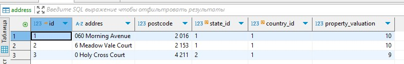

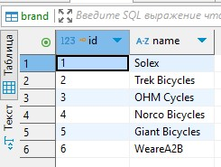

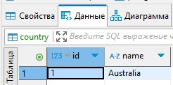

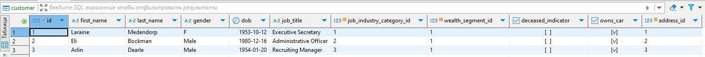

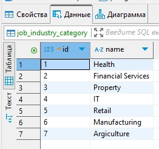

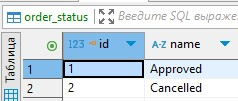

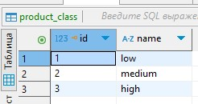

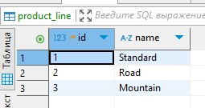

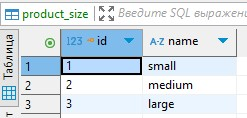

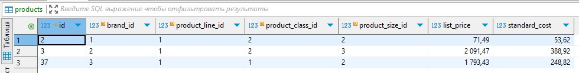

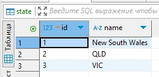

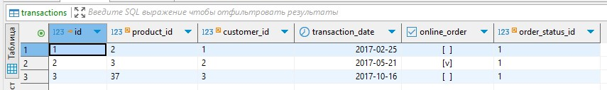

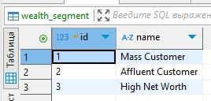
