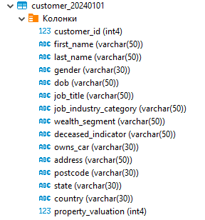

# Основные операторы PostgreSQL (vo_HW)
### Выполнил: Зимаков Максим Александрович
### Тема домашней работы: Основные операторы PostgreSQL.
### Цель домашней работы: Научиться работать с основными операторами PostgreSQL, фильтровать таблицы по разным условиям, писать вложенные запросы, объединять таблицы.
### Формулировка задания: 
Дано два csv-файла с данными о клиентах ([customer.csv](https://github.com/Max-Zima/mipt-data-storage-and-processing-systems/blob/master/Домашнее%20задание%202.%20Основные%20операторы%20PostgreSQL/customer.csv)) и их транзакциях ([transaction.csv](https://github.com/Max-Zima/mipt-data-storage-and-processing-systems/blob/master/Домашнее%20задание%202.%20Основные%20операторы%20PostgreSQL/transaction.csv)).
**Необходимо выполнить следующее:**
1. Создать таблицы со следующими структурами и загрузить данные из csv-файлов. Детали приведены ниже.
   
  Описание таблицы customer:

| Поле | Описание |
| --------------- | ---------------- |
| customer_id |	id клиента |
| first_name |	имя клиента |
| last_name |	фамилия клиента |
| gender |	пол |
| DOB |	дата рождения |
| job_title |	профессия |
| job_industry_category	| сфера деятельности |
| wealth_segment | сегмент благосостояния |
| deceased_indicator | флаг актуального клиента |
| owns_car |	флаг наличия автомобиля |
| address |	адрес проживания |
| postcode |	почтовый индекс |
| state |	штаты |
| country |	страна проживания |
| property_valuation | оценка имущества| 

| Left-aligned | Center-aligned | Right-aligned |
| :---         |     :---:      |          ---: |
| git status   | git status     | git status    |
| git diff     | git diff       | git diff      |
