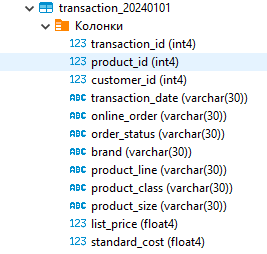
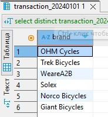

# Основные операторы PostgreSQL (vo_HW)
### Выполнил: Зимаков Максим Александрович
### Тема домашней работы: Основные операторы PostgreSQL.
### Цель домашней работы: Научиться работать с основными операторами PostgreSQL, фильтровать таблицы по разным условиям, писать вложенные запросы, объединять таблицы.
### Формулировка задания: 
Дано два csv-файла с данными о клиентах ([customer.csv](https://github.com/Max-Zima/mipt-data-storage-and-processing-systems/blob/master/Домашнее%20задание%202.%20Основные%20операторы%20PostgreSQL/customer.csv)) и их транзакциях ([transaction.csv](https://github.com/Max-Zima/mipt-data-storage-and-processing-systems/blob/master/Домашнее%20задание%202.%20Основные%20операторы%20PostgreSQL/transaction.csv)).
**Необходимо выполнить следующее:**
1. Создать таблицы со следующими структурами и загрузить данные из csv-файлов. Детали приведены ниже.
   
   

   
   
  Описание таблицы customer:

| Поле | Описание |
| --------------- | ---------------- |
| customer_id |	id клиента |
| first_name |	имя клиента |
| last_name |	фамилия клиента |
| gender |	пол |
| DOB |	дата рождения |
| job_title |	профессия |
| job_industry_category	| сфера деятельности |
| wealth_segment | сегмент благосостояния |
| deceased_indicator | флаг актуального клиента |
| owns_car |	флаг наличия автомобиля |
| address |	адрес проживания |
| postcode |	почтовый индекс |
| state |	штаты |
| country |	страна проживания |
| property_valuation | оценка имущества| 

Описание таблицы transaction:

| Поле | Описание |
| --------------- | ---------------- |
| transaction_id |	id транзакции |
| product_id | id продукта |
| customer_id |	id клиента |
| transaction_date |	дата транзакции |
| online_order |	флаг онлайн-заказа |
| order_status |	статус транзакции |
| brand	| бренд |
| product_line | линейка продуктов |
| product_class | класс продукта |
| product_size |	размер продукта |
| list_price |	цена |
| standard_cost |	стандартная стоимость |

2. Выполнить следующие запросы:

    * (1 балл) Вывести все уникальные бренды, у которых стандартная стоимость выше 1500 долларов.
    * (1 балл) Вывести все подтвержденные транзакции за период '2017-04-01' по '2017-04-09' включительно.
    * (1 балл) Вывести все профессии у клиентов из сферы IT или Financial Services, которые начинаются с фразы 'Senior'.
    * (1 балл) Вывести все бренды, которые закупают клиенты, работающие в сфере Financial Services
    * (1 балл) Вывести 10 клиентов, которые оформили онлайн-заказ продукции из брендов 'Giant Bicycles', 'Norco Bicycles', 'Trek Bicycles'.
    * (1 балл) Вывести всех клиентов, у которых нет транзакций.
    * (2 балла) Вывести всех клиентов из IT, у которых транзакции с максимальной стандартной стоимостью.
    * (2 балла) Вывести всех клиентов из сферы IT и Health, у которых есть подтвержденные транзакции за период '2017-07-07' по '2017-07-17'.
  
## Выполнение:

### SQL скрипт: [Скрипт](https://github.com/Max-Zima/mipt-data-storage-and-processing-systems/blob/master/Домашнее%20задание%202.%20Основные%20операторы%20PostgreSQL/sql_script.sql)

### Задание 1:

Вывести все уникальные бренды, у которых стандартная стоимость выше 1500 долларов.

```postgresql
-- Задание 1 --
select distinct brand from transaction_20240101
where standard_cost > 1500;
```

**Результат:**


### Задание 2:

Вывести все подтвержденные транзакции за период '2017-04-01' по '2017-04-09' включительно.

```postgresql
-- Задание 2 --
select * from transaction_20240101 
where order_status = 'Approved' 
and transaction_date::date between '2017-04-01' and '2017-04-09';
```

**Результат:**


### Задание 3:

Вывести все профессии у клиентов из сферы IT или Financial Services, которые начинаются с фразы 'Senior'.

```postgresql
-- Задание 3 --
select distinct job_title from customer_20240101
where job_industry_category in ('IT', 'Financial Services') and job_title like 'Senior%';
```

**Результат:**


### Задание 4:

Вывести все бренды, которые закупают клиенты, работающие в сфере Financial Services

```postgresql
-- Задание 4 --
select distinct transaction_20240101.brand from transaction_20240101
inner join customer_20240101 on customer_20240101.customer_id = transaction_20240101.customer_id
where customer_20240101.job_industry_category = 'Financial Services' and transaction_20240101.brand like '_%';
```

**Результат:**




### Задание 5:

Вывести 10 клиентов, которые оформили онлайн-заказ продукции из брендов 'Giant Bicycles', 'Norco Bicycles', 'Trek Bicycles'.

```postgresql
-- Задание 5 --
select distinct c.customer_id, c.first_name, c.last_name, c.job_title, t.online_order from customer_20240101 c
inner join transaction_20240101 t on c.customer_id = t.customer_id
where t.brand in ('Giant Bicycles', 'Norco Bicycles', 'Trek Bicycles')
and t.online_order = 'True'
limit 10;
```

**Результат:**


### Задание 6:

Вывести всех клиентов, у которых нет транзакций.

```postgresql
-- Задание 6 --
-- Вариант решения 1 --
select c.customer_id, c.first_name, c.last_name from customer_20240101 c
where c.customer_id not in (select distinct t.customer_id from transaction_20240101 t);

-- Вариант решения 2 --
select c.customer_id, c.first_name, c.last_name from customer_20240101 c
full outer join transaction_20240101 t on c.customer_id = t.customer_id
where t.customer_id is null;
```

**Результат:**


### Задание 7:

Вывести всех клиентов из IT, у которых транзакции с максимальной стандартной стоимостью.

```postgresql
-- Задание 7 --
-- Версия с максимальной стандратной стоимостью вообще --
select distinct c.* from customer_20240101 c
left join transaction_20240101 t on c.customer_id = t.customer_id
where c.job_industry_category = 'IT' 
and t.standard_cost = (select max(standard_cost) from transaction_20240101);

-- Версия с максимальной стандратной стоимостью относительно IT --
select distinct * from customer_20240101 c
left join transaction_20240101 t on c.customer_id = t.customer_id
where c.job_industry_category = 'IT' 
and t.standard_cost = (select max(t2.standard_cost) from transaction_20240101 t2
					   inner join customer_20240101 c2 on c2.customer_id = t2.customer_id
    				   where c2.job_industry_category = 'IT');
```

**Результат:**


### Задание 8:

Вывести всех клиентов из сферы IT и Health, у которых есть подтвержденные транзакции за период '2017-07-07' по '2017-07-17'.

```postgresql

```

**Результат:**
-- Задание 8 --
select distinct c.* from customer_20240101 c
inner join transaction_20240101 t on c.customer_id = t.customer_id
where c.job_industry_category in ('IT', 'Health')
and t.order_status = 'Approved' 
and t.transaction_date::date BETWEEN '2017-07-07' and '2017-07-17';

