# Группировка данных и оконные функции (vo_HW)
### Выполнил: Зимаков Максим Александрович
### Тема домашней работы: Группировка данных и оконные функции.
### Цель домашней работы: Научиться группировать и агрегировать данные, считать на их основе множество показателей.
### Формулировка задания: 
Дано два csv-файла с данными о клиентах ([customer.csv](https://github.com/Max-Zima/mipt-data-storage-and-processing-systems/blob/master/Домащнее%20задание%203.%20Группировка%20данных%20и%20оконные%20функции/customer.csv)) и их транзакциях ([transaction.csv](https://github.com/Max-Zima/mipt-data-storage-and-processing-systems/blob/master/Домащнее%20задание%203.%20Группировка%20данных%20и%20оконные%20функции/transaction.csv)).
**Необходимо выполнить следующее:**
1. Создать таблицы со следующими структурами и загрузить данные из csv-файлов. Детали приведены ниже.
   
   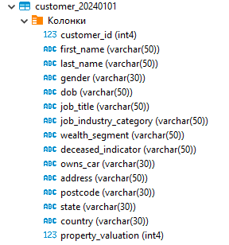

   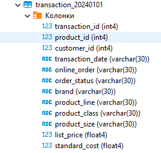
   
  Описание таблицы customer:

| Поле | Описание |
| --------------- | ---------------- |
| customer_id |	id клиента |
| first_name |	имя клиента |
| last_name |	фамилия клиента |
| gender |	пол |
| DOB |	дата рождения |
| job_title |	профессия |
| job_industry_category	| сфера деятельности |
| wealth_segment | сегмент благосостояния |
| deceased_indicator | флаг актуального клиента |
| owns_car |	флаг наличия автомобиля |
| address |	адрес проживания |
| postcode |	почтовый индекс |
| state |	штаты |
| country |	страна проживания |
| property_valuation | оценка имущества| 

Описание таблицы transaction:

| Поле | Описание |
| --------------- | ---------------- |
| transaction_id |	id транзакции |
| product_id | id продукта |
| customer_id |	id клиента |
| transaction_date |	дата транзакции |
| online_order |	флаг онлайн-заказа |
| order_status |	статус транзакции |
| brand	| бренд |
| product_line | линейка продуктов |
| product_class | класс продукта |
| product_size |	размер продукта |
| list_price |	цена |
| standard_cost |	стандартная стоимость |

2. Выполнить следующие запросы:

    * (1 балл) Вывести распределение (количество) клиентов по сферам деятельности, отсортировав результат по убыванию количества.
    * (1 балл) Найти сумму транзакций за каждый месяц по сферам деятельности, отсортировав по месяцам и по сфере деятельности.
    * (1 балл) Вывести количество онлайн-заказов для всех брендов в рамках подтвержденных заказов клиентов из сферы IT.
    * (2 балла) Найти по всем клиентам сумму всех транзакций (list_price), максимум, минимум и количество транзакций, отсортировав результат по убыванию суммы транзакций и количества клиентов. Выполните двумя способами: используя только group by и используя только оконные функции. Сравните результат. 
    * (2 балла) Найти имена и фамилии клиентов с минимальной/максимальной суммой транзакций за весь период (сумма транзакций не может быть null). Напишите отдельные запросы для минимальной и максимальной суммы.
    * (1 балл) Вывести только самые первые транзакции клиентов. Решить с помощью оконных функций.
    * (2 балла) Вывести имена, фамилии и профессии клиентов, между транзакциями которых был максимальный интервал (интервал вычисляется в днях)
  
## Выполнение:

### SQL скрипт: [Скрипт](https://github.com/Max-Zima/mipt-data-storage-and-processing-systems/blob/master/Домащнее%20задание%203.%20Группировка%20данных%20и%20оконные%20функции/sql_script.sql)

### Задание 1:

Вывести распределение (количество) клиентов по сферам деятельности, отсортировав результат по убыванию количества.

```postgresql
-- Задание 1 --
select job_industry_category, count(*) as cnt_customers 
from customer_20240101 c 
group by c.job_industry_category
order by cnt_customers desc;
```

**Результат:**

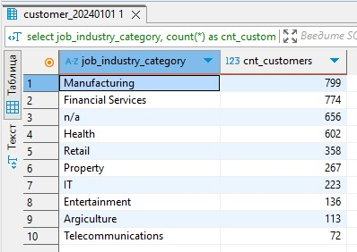

### Задание 2:

Найти сумму транзакций за каждый месяц по сферам деятельности, отсортировав по месяцам и по сфере деятельности.

```postgresql
-- Задание 2 --
select date_trunc('month', t.transaction_date::date) as t_month, c.job_industry_category, sum(t.list_price) as sum_transaction
from customer_20240101 c 
inner join transaction_20240101 t on t.customer_id = c.customer_id
group by t_month, c.job_industry_category
order by t_month, c.job_industry_category;
```

**Результат:**

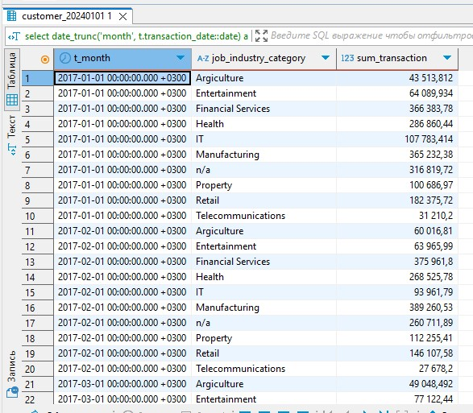

### Задание 3:

Вывести количество онлайн-заказов для всех брендов в рамках подтвержденных заказов клиентов из сферы IT.

```postgresql
-- Задание 3 --
select brand, count(*) as cnt_online_orders
from transaction_20240101 t 
inner join customer_20240101 c on c.customer_id = t.customer_id 
where c.job_industry_category = 'IT' 
	and t.order_status = 'Approved'
	and t.online_order = 'True'
group by t.brand
having brand like '_%';
```

**Результат:**

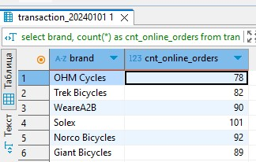

### Задание 4:

Найти по всем клиентам сумму всех транзакций (list_price), максимум, минимум и количество транзакций, отсортировав результат по убыванию суммы транзакций и количества клиентов. Выполните двумя способами: используя только group by и используя только оконные функции. Сравните результат.

```postgresql
-- Задание 4 --
-- Используем group by --
select t.customer_id
	,sum(t.list_price) as sum_transaction
	,max(t.list_price) as max_transaction
	,min(t.list_price) as min_transaction
	,count(t.list_price) as cnt_transaction
from transaction_20240101 t 
group by t.customer_id
order by sum_transaction desc, cnt_transaction desc;

-- Используем оконную функцию --
select t.customer_id
	,sum(t.list_price) over (partition by t.customer_id) as sum_transaction
	,max(t.list_price) over (partition by t.customer_id) as max_transaction
	,min(t.list_price) over (partition by t.customer_id) as min_transaction
	,count(t.list_price) over (partition by t.customer_id) as cnt_transaction
from transaction_20240101 t 
order by sum_transaction desc, cnt_transaction desc;

-- Используем оконную функцию но чтобы не повторялись строки--
select distinct t.customer_id
	,sum(t.list_price) over (partition by t.customer_id) as sum_transaction
	,max(t.list_price) over (partition by t.customer_id) as max_transaction
	,min(t.list_price) over (partition by t.customer_id) as min_transaction
	,count(t.list_price) over (partition by t.customer_id) as cnt_transaction
from transaction_20240101 t 
order by sum_transaction desc, cnt_transaction desc;

```

**Результат:**

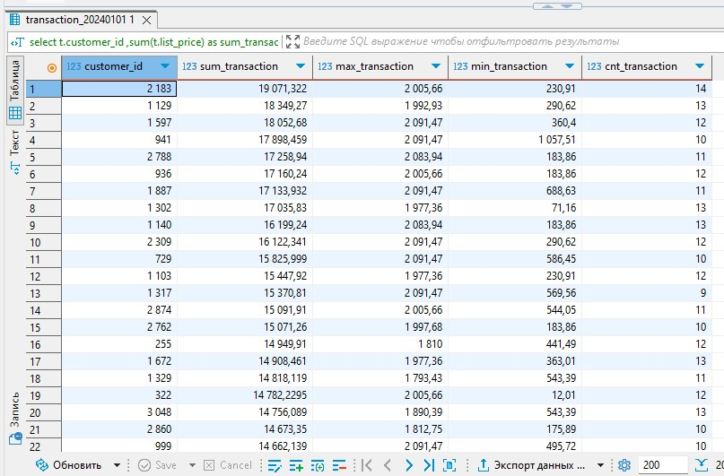

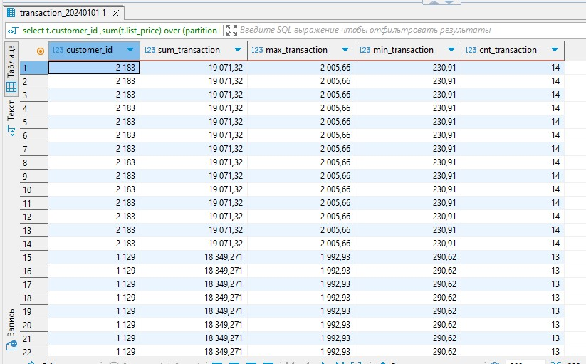

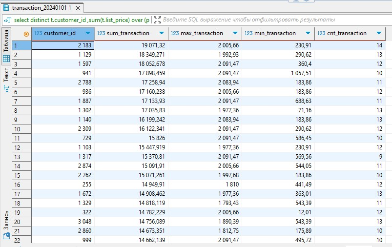

### Задание 5:

Найти имена и фамилии клиентов с минимальной/максимальной суммой транзакций за весь период (сумма транзакций не может быть null). Напишите отдельные запросы для минимальной и максимальной суммы.

```postgresql
-- Задание 5 --
-- Минимальная сумма --
-- null преобразуется в 0 --
with customer_spending as (
	select 
		c.customer_id
		,c.first_name
		,c.last_name
		,coalesce(sum(t.list_price), 0) as total_spent
	from customer_20240101 c
	left join transaction_20240101 t on c.customer_id = t.customer_id
	group by c.customer_id, c.first_name, c.last_name
)
select first_name, last_name, total_spent 
from customer_spending
where total_spent = (select min(total_spent) from customer_spending);

-- null просто не используем в запросе --
with customer_spending as (
	select 
		c.customer_id
		,c.first_name
		,c.last_name
		,sum(t.list_price) as total_spent
	from customer_20240101 c
	left join transaction_20240101 t on t.customer_id = c.customer_id
	group by c.customer_id, c.first_name, c.last_name
)
select first_name, last_name, total_spent 
from customer_spending
where total_spent = (select min(total_spent) from customer_spending);

-- Максимальная сумма --
-- null преобразуется в 0 --
create view customer_spending_2_1 as 
	select 
		c.customer_id
		,c.first_name
		,c.last_name
		,coalesce(sum(t.list_price), 0) as total_spent
	from customer_20240101 c
	left join transaction_20240101 t on c.customer_id = t.customer_id
	group by c.customer_id, c.first_name, c.last_name


select * from customer_spending_2_1 where total_spent = (select max(total_spent) from customer_spending_2_1);

-- null просто не используем в запросе --
create view customer_spending_2_2 as
	select 
		c.customer_id
		,c.first_name
		,c.last_name
		,sum(t.list_price) as total_spent
	from customer_20240101 c
	left join transaction_20240101 t on t.customer_id = c.customer_id
	group by c.customer_id, c.first_name, c.last_name

	
select * from customer_spending_2_2 where total_spent = (select max(total_spent) from customer_spending_2_2);
```

**Результат:**

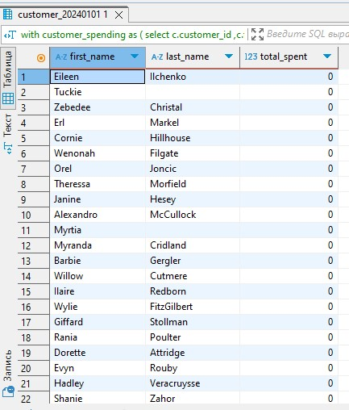

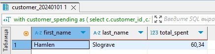

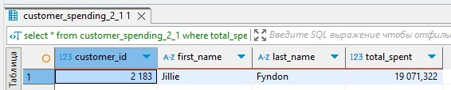

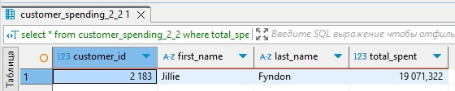

### Задание 6:

Вывести только самые первые транзакции клиентов. Решить с помощью оконных функций.

```postgresql
-- Задание 6 --
select customer_id, transaction_id, transaction_date 
from (select 
		customer_id
		,transaction_id
		,transaction_date
		,row_number() over (partition by customer_id order by transaction_date) as rn
from transaction_20240101
)
where rn = 1
```

**Результат:**

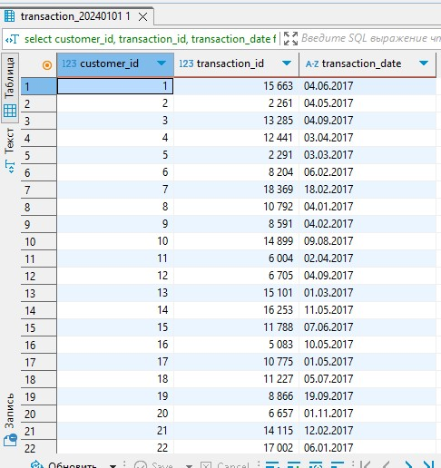


### Задание 7:

Вывести имена, фамилии и профессии клиентов, между транзакциями которых был максимальный интервал (интервал вычисляется в днях).

```postgresql
-- Задание 7 --
with transaction_intervals as (
	select
		c.customer_id
        ,c.first_name
        ,c.last_name
        ,c.job_title
        ,lead(t.transaction_date::date) over (partition by c.customer_id order by t.transaction_date::date) - t.transaction_date::date as interval_days
    from transaction_20240101 t
    inner join customer_20240101 c on t.customer_id = c.customer_id 
)
select
	*
from transaction_intervals
where interval_days = (select max(interval_days) from transaction_intervals);
```

**Результат:**

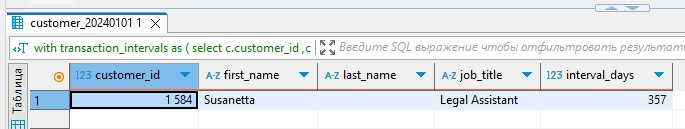

